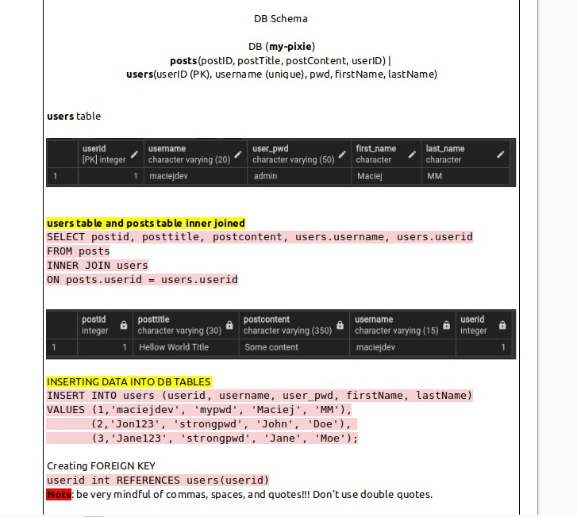

# mypixie Project

### Table of Content

- [What is this project about?](#what-is-this-project-about?)

- [Why did I choose this project?](#why-did-I-choose-this-project)

- [Challenges](#challenges)

- [Screenshots and Details](#screenshots-and-details)

- [Current Progress](#current-progress)

- [Updates](#updates)

## What is this project about?

This project is about creating a demo website where users can make posts just like on regular social media websites, with the addition of extra handy information such as latest news and weather information on their respective panel sides of the website (or tabs if on a mobile device).

With a small added benefit of a pixie that would - _eventually_ - deliver tailored news, information or help the users make posts or suggestions.

## Why did I choose this project?

I chose this project to expose myself to the entire process of building web-based applications and solidify my newly acquired software and web developer skills. In the current market, it is very hard to stand out as a self-taught or bootcamp graduate developer.

I believe that by doing this project entirely from the ground up, setting up databases, creating tables, PK/FK keys, connecting it all up to the back-end, creating routes, paths, linking it up with the front-end, all while trying my best to keep best coding practises would favourably highlight my technical skills and aptitude, since I am covering the full-stack route, compared to the traditional front-end only or back-end only path.

At the same time, I'm aware this project is much larger in scale than the ones I have created so far and will require significant studying, especially when it will come to implementing the basic version of the pixie (I expcet a lot of hours of learning about LLM and AI, where my knowledge is lacking and is at a bare minimum for now).

Nevertheless, I do have a strong aptitude for self-learning and expanding my skills, so I will tackle this challenge one step at a time, research thoroughly and use all tools at my disposal.

I will create an update section in this README file, where latest comments can be seen regarding this project.

## Challenges

During the early stages of this project, I have already came across many challenges. These challenges ranged from Virtual Machine (VMs) setup, software / program issues in Ubuntu, configuring SSH key for GitHub, errors with fetching and filtering data from PostgreSQL database and so on.

These challenges and their resolutions can be viewed in the LibreOffice Writer document, where I am keeping track of almost all things: from the initial setup, issues and their resolutions to now.

Below is a small list of a handful of challenges that I resolved and encoutnered in this project:

- Problem while configuring the SSH key (resolved: cannot use sudo user for that)
- Designing PostgreSQL database schema, tables, column names, and unique quirks to avoid issues later on
- Figuring out how to connect tables using keys in PostgreSQL (resolved - with help of Google. Did not work with PostgreSQL before)
- Python (Flask) failed to connect to the database (resolved: authentication error - password)
- Learning about blueprints, views and Flask things - takes some time

## Screenshots and Details

LibreOffice Writer notes regarding creating the database tables.
Things I had to consider were: data types, character legnths, limitations, connecting the two tables on common column, e.g. userid, system friendly names, etc.

Page layout template of the desktop version. Subject to change.

Successful fetch of the filtered time and username from the PostgreSQL database

## Current Progress

- Created postgreSQL database tables and populated it with dummy data via SQL script
- Successfully created two tables and linked them on userid with Primary and Foreign Keys
- Successfully linked DB to the front-end via Python (Flask) back-end
- Successfully fetched time and username data from the database using React

#### To-Do:

- Further test application and fetching method
- Fully document and clean-up the Flask code
- Tidy up the React code and add notes for clarity
- Update the Libre Writer documentation and remove duplicate information
- Study AI / LLM and implement it
- Implement testing e.g. Jest
- And much more...

## Updates

    [ 02/Oct/2024 ]

    Due to personal and family matters I was unable to look further into this project since I started working on it around 7 months ago and had to postpone it. Currently my focus and time is required elsewhere, however, I'll try to dedicate whatever time I have available to make little progress or at least send updates to this README file.
